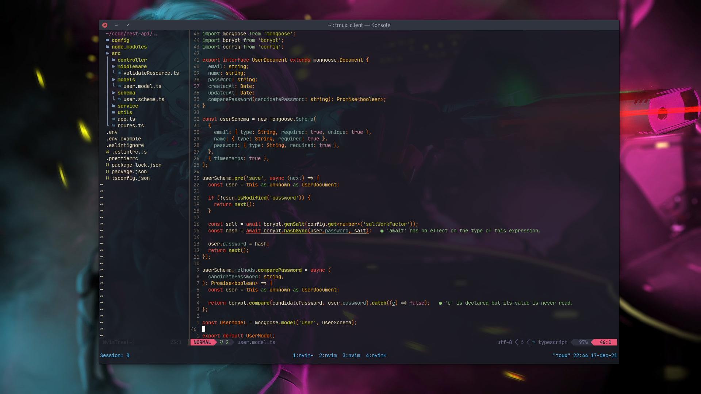
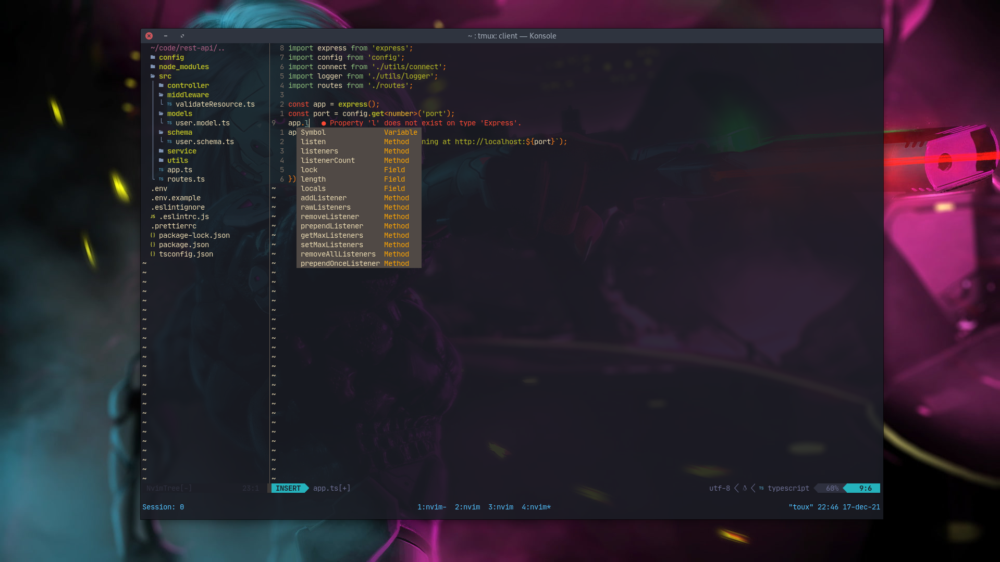

## Neovim + TMUX configurations

Running this on Debian 11 Bullseye inside [Kitty Terminal](https://sw.kovidgoyal.net/kitty/).

Using Neovims built-in LSP with plugins such as tree-sitter and nvim-cmp and telescope.
This config is mainly for web development (TypeScript, React, JavaScript, Go) and I will adjust it as I'm learning.

Requires Neovim 0.6.0+

### **Dependencies**

- [git](https://git-scm.com/)
- [npm](https://www.npmjs.com/) (for some Vim dependencies - see line below)
- [nodejs](https://nodejs.org/en/) (even though I recommend installing [Node Version Manager](https://github.com/nvm-sh/nvm) which will automatically install npm too, installing them independently will do too)
- [ripgrep](https://github.com/BurntSushi/ripgrep) (for ripgrep inside fuzzy-finder)
- [packer.nvim](https://github.com/wbthomason/packer.nvim) (to install plugins)
- [StyLua](https://github.com/JohnnyMorganz/StyLua) (since the config is written in lua, it'll help make it pretty)
- [LSP (language servers)](https://github.com/neovim/nvim-lspconfig/blob/master/doc/server_configurations.md) (required ones can be found inside lua/lsp/init.lua)
